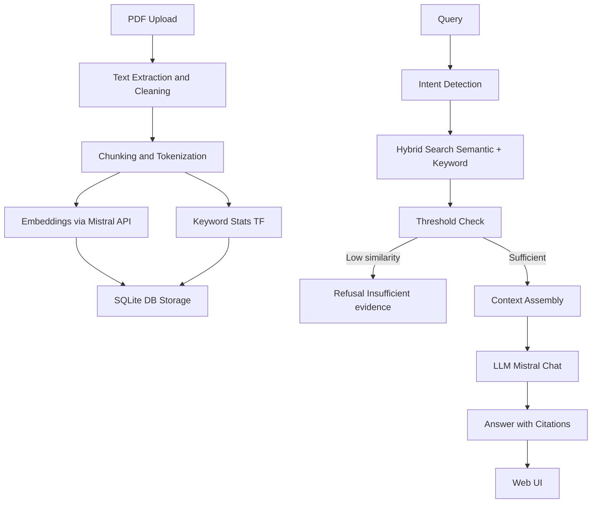

# RAG Pipeline with FastAPI & Mistral AI

This project implements a **Retrieval-Augmented Generation (RAG)** system from scratch.  
It ingests PDF documents, extracts and chunks text, embeds those chunks, and enables querying via semantic + keyword search.  
Responses are generated through **Mistral AI LLM**, with citations to the supporting document passages.

---

## Key Features

### PDF Ingestion & Chunking
- Upload one or more PDF files via FastAPI.
- Text extracted with **PyPDF2** and cleaned (whitespace normalization, empty-page skip).
- Chunking uses a **sliding window with overlap** (`CHUNK_SIZE` and `CHUNK_OVERLAP` configurable).
- Each chunk is tokenized and indexed with:
  - Semantic embeddings (for similarity search).
  - Term-frequency maps (for keyword matching).

### Query Processing
- Lightweight **intent detection** (e.g., greetings like “hello” don’t trigger retrieval).
- Query normalization (lowercasing, whitespace trimming).
- Prepared for more advanced query rewriting if extended.

### Hybrid Semantic Search
- **Cosine similarity** on embeddings + **TF-IDF–style keyword scores** combined.
- Balances semantic meaning with keyword precision.
- No external libraries or vector databases — **all retrieval implemented in SQLite + NumPy**.

### Post-processing
- Top-k results merged and re-ranked.
- **Threshold check**: if average similarity is below `COSINE_THRESHOLD`, system refuses with  
  *“Insufficient evidence to answer confidently.”*
- Results contextualized and passed to the LLM with citations.

### Answer Generation
- **Mistral AI API (`mistralai`)** used for completions.
- System prompt enforces grounding: *“Answer only using the provided context. Cite sources.”*
- Answers include inline citations: `[doc:page:chunk]`.

### Web UI
- Modern **chat-style frontend** with:
  - PDF upload
  - Reset button to clear KB
  - Smooth chat bubbles (user/right, assistant/left)
  - Auto-scroll and enter-to-send
- Built with **vanilla HTML/CSS/JS** for simplicity.

### Bonus Features
- No third-party vector DB (embeddings stored in SQLite).
- Citations required.
- Answer shaping (e.g., structured tables).
- Hallucination filters (check unsupported claims).

---

## 🖇️ System Architecture



---

## Tech Stack
- **Backend:** FastAPI  
- **LLM:** Mistral AI API  
- **Text Extraction:** PyPDF2  
- **Database:** SQLite (stores docs, chunks, embeddings, TF maps)  
- **Vector Math:** NumPy  
- **Frontend:** HTML/CSS/JavaScript  

---

## Project Structure

```
rag_pipeline/
├── app/
│   ├── main.py          # FastAPI entry (ingest, query, reset)
│   ├── pdf_ingest.py    # Extraction, cleaning, chunking, embeddings
│   ├── retrieval.py     # Hybrid search logic
│   ├── store.py         # SQLite persistence
│   ├── config.py        # Settings (chunk size, thresholds, API keys)
│   └── database.py      # DB init and connection
│   └── static/
│       └── index.html       # Chat UI
├── requirements.txt
├── .gitignore
└── README.md
```

---

## Setup & Run

### 1. Clone repo & create venv
```bash
git clone https://github.com/kaartikeya15/rag_pipeline.git
cd rag_pipeline
python3 -m venv venv
source venv/bin/activate
```

### 2. Install dependencies
```bash
pip install -r requirements.txt
```

### 3. Configure API Key
Create `.env`:
```
MISTRAL_API_KEY=your_api_key_here
CHUNK_SIZE=500
CHUNK_OVERLAP=50
TOP_K=3
COSINE_THRESHOLD=0.75
```

### 4. Run server
```bash
uvicorn app.main:app --reload
```

### 5. Access UI
Open: [http://127.0.0.1:8000/static/index.html](http://127.0.0.1:8000/static/index.html)

---

## Example Usage

### Upload
Click 'Choose Files' and upload PDF. Click the 'Upload' button to activate ingest.
```
POST /ingest (multipart/form-data)
```
Response:
```json
{ "document_id": 1, "name": "file.pdf" }
```

### Query
After file upload confirmed chatbot, type in query and press Enter or click 'Send' to feed the query to LLM.
```
POST /query
{ "query": "Summarize this document" }
```
Response:
```json
{
  "answer": "Revenue grew by 7% ... [doc:file.pdf:p44:366]",
  "sources": ["file.pdf"]
}
```

### Clear knowledge base
For deleting document information, click 'Clear knowledge base'.
```
POST /reset
```


---

## Design Considerations
- **Chunking with overlap**: avoids semantic breaks mid-sentence; overlap preserves context continuity.  
- **SQLite instead of vector DB**: keeps dependencies light, matches bonus point requirement.  
- **Hybrid retrieval**: semantic search handles paraphrasing, keywords catch exact matches.  
- **Threshold refusal**: prevents hallucinations by enforcing evidence.  
- **Citations**: ensures transparency and trustworthiness.  
- **Extensibility**: UI and backend designed to plug in more advanced intent classification, structured answer shaping, and safety policies.  

---

## Author
**Kaartikeya Panjwani**  
Master’s in CS, New York University
